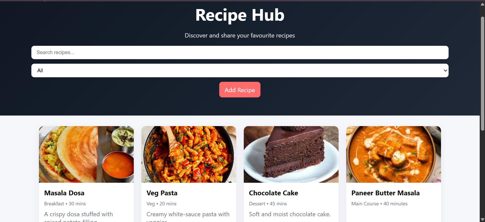

# 🍽️ Recipe Sharing Website

A frontend **Recipe Sharing Website** that allows users to explore, search, and share delicious recipes. The project provides an easy-to-use interface where users can browse recipes, view detailed cooking instructions, and add their own recipes. It is designed with a responsive layout to provide a smooth experience across different devices.

## Features

* Browse a collection of recipes
* Search recipes by name
* Filter recipes by category
* View detailed recipe information
* Add new recipes
* Store recipes using Local Storage
* Responsive and user-friendly interface

## Technologies Used

* HTML5
* CSS3
* JavaScript (ES6)
* Local Storage

## Purpose

This project was created to practice frontend development skills by building a responsive and interactive recipe management application using HTML, CSS, and JavaScript.

## Project Screenshot

## Author

Nidhi Soni
